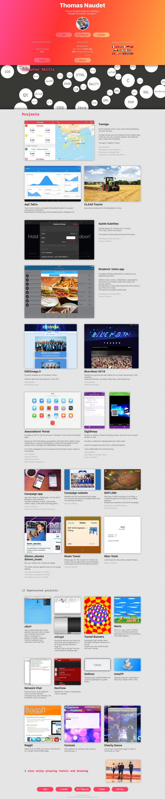

# My website

##Features
- Short bio
- Current & past projects
- Computer skills
- Some paintings as a bonus
- Last song tweeted
- GitHub stats
- Country visited
- Links

## TODO
- Optimize CSS3 linear gradient background animation CPU usage

## Licence

    Copyright © 2015-2016 Thomas NAUDET

    This program is free software: you can redistribute it and/or modify
    it under the terms of the GNU General Public License as published by
    the Free Software Foundation, either version 3 of the License, or
    (at your option) any later version.

    This program is distributed in the hope that it will be useful,
    but WITHOUT ANY WARRANTY; without even the implied warranty of
    MERCHANTABILITY or FITNESS FOR A PARTICULAR PURPOSE.  See the
    GNU General Public License for more details.

    You should have received a copy of the GNU General Public License
    along with this program. If not, see http://www.gnu.org/licenses/
